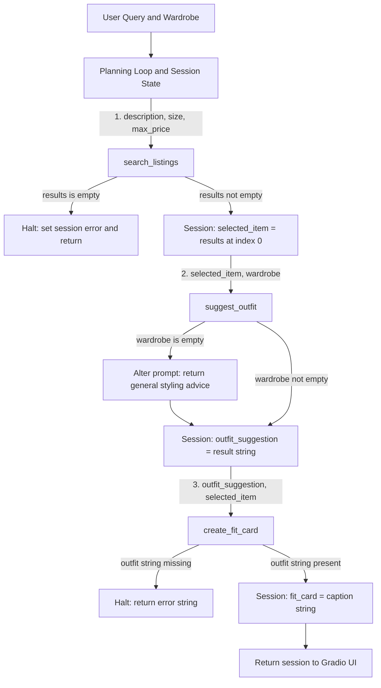

# FitFindr — planning.md

> Complete this document before writing any implementation code.
> Your spec and agent diagram are what you'll use to direct AI tools (Claude, Copilot, etc.) to generate your implementation — the more specific they are, the more useful the generated code will be.
> Your planning.md will be reviewed as part of your submission.
> Update it before starting any stretch features.

---

## Tools

List every tool your agent will use. For each tool, fill in all four fields.
You must have at least 3 tools. The three required tools are listed — add any additional tools below them.

### Tool 1: search_listings

**What it does:**
Searches the mock database of secondhand listings for items that match the user's desired description, size, and maximum price. It scores the matching items by relevance (counting keyword overlaps in the listing's title, description, and style_tags) and sorts them.

**Input parameters:**
- `description` (str): Keywords describing the desired item (e.g., "vintage graphic tee").
- `size` (str): The requested size (optional, case-insensitive).
- `max_price` (float): The maximum price constraint (optional).

**What it returns:**
A list of listing dictionaries, sorted by relevance score (highest first). Each dictionary contains fields like id, title, description, category, style_tags, size, price, etc.

**What happens if it fails or returns nothing:**
If no listings match the filters, it returns an empty list `[]` without throwing an error. The agent's planning loop must detect this, halt the interaction, and return a helpful error message to the user.

---

### Tool 2: suggest_outfit

**What it does:**
Uses an LLM (Groq) to generate 1-2 complete outfit ideas by combining the newly found thrifted item with existing pieces from the user's wardrobe.

**Input parameters:**
- `new_item` (dict): The selected listing dictionary returned from Step 1.
- `wardrobe` (dict): The user's current wardrobe data, containing an 'items' list of clothing dictionaries.

**What it returns:**
A string containing the outfit suggestion(s) written in a natural, conversational tone.

**What happens if it fails or returns nothing:**
If the user's wardrobe list is empty, it does not fail. Instead, it alters the LLM prompt to return general styling advice for the `new_item` (what vibe it suits, what to pair it with generally).

---

### Tool 3: create_fit_card

**What it does:**
Uses an LLM to craft a short, catchy, 2-4 sentence social media caption (a "fit card") based on the outfit suggestion and the specific item details. It uses a higher LLM temperature (e.g., 0.7-0.9) to ensure the caption sounds uniquely creative and different each time.

**Input parameters:**
- `outfit` (str): The outfit suggestion string generated by the `suggest_outfit` tool.
- `new_item` (dict): The same listing dictionary of the thrifted item.

**What it returns:**
A formatted string containing a casual, authentic social media caption, mentioning the item's price and platform.

**What happens if it fails or returns nothing:**
If the `outfit` string is missing or empty, it returns a descriptive error message string (e.g., "Unable to create fit card: outfit details missing") instead of crashing.

---

## Planning Loop

**How does your agent decide which tool to call next?**
The agent uses a context-aware planning loop that responds dynamically to the output of each tool:
1. After calling Tool 1 (`search_listings`), it checks if `results` is empty. If yes, it sets `session["error"] = "Sorry, I couldn't find any items matching your filters."` and returns early. If no, it sets `session["selected_item"] = results[0]` and proceeds.
2. It calls Tool 2 (`suggest_outfit`) using `session["selected_item"]` and `session["wardrobe"]`. If the wardrobe is empty, it dynamically alters the prompt strategy to offer general styling advice rather than failing, then stores the string in `session["outfit_suggestion"]`.
3. Finally, it calls Tool 3 (`create_fit_card`) using the outfit string and selected item. If outfit data is missing, it sets an error and halts, otherwise it stores the output in `session["fit_card"]`.

---

## State Management

**How does information from one tool get passed to the next?**
State is managed via a single `session` dictionary that acts as the single source of truth during a run. It stores: the parsed query parameters, `search_results`, `selected_item`, `wardrobe`, `outfit_suggestion`, `fit_card`, and an `error` flag. 
Information flows sequentially: Tool 1's output is saved to `session["search_results"]` and `session["selected_item"]`. Tool 2 reads `session["selected_item"]` and saves its result to `session["outfit_suggestion"]`. Tool 3 reads both to generate `session["fit_card"]`.

---

## Error Handling

| Tool | Failure mode | Agent response |
|------|-------------|----------------|
| search_listings | No results match the query | Sets `session["error"]` to: "Sorry, I couldn't find any items matching your filters. Try adjusting your description or price!" and returns the session early. |
| suggest_outfit | Wardrobe is empty | Prompts the LLM to generate generic styling advice instead of specific wardrobe combinations. Does not crash. |
| create_fit_card | Outfit input is missing or incomplete | Returns a string indicating "Unable to create fit card due to missing outfit details." |

---

## Architecture

---

## AI Tool Plan

**Milestone 3 — Individual tool implementations:**
I will use ChatGPT/Claude to implement `tools.py`. I will provide my `planning.md` tool specs. To verify `search_listings`, I will run 3 test queries: one that should return results, one with a price too low to match anything, and one with a size that doesn't exist. I'll verify the empty-result case returns [] and not an error. For `suggest_outfit`, I'll test once with `get_example_wardrobe()` and once with `get_empty_wardrobe()`, and confirm the output string changes between the two.

**Milestone 4 — Planning loop and state management:**
I will use ChatGPT/Claude to implement `agent.py`. I will paste my "Planning Loop", "State Management", and `_new_session` dict structure. To verify the logic, I will test the final `run_agent` with a query that returns no results to confirm it halts early with the correct error message. I will also run it with both `get_example_wardrobe()` and `get_empty_wardrobe()` to verify the exact error handling messages and state transitions.

---

## A Complete Interaction (Step by Step)

Write out what a full user interaction looks like from start to finish — tool call by tool call. Use a specific example query.

FitFindr is an AI agent that takes a user's natural language request to search for secondhand clothing, finds matching items, and suggests how to style them using the user's existing wardrobe. It sequentially triggers three tools: searching for listings based on the parsed query, generating an outfit recommendation using the found item, and creating a social media fit card. If a tool fails (such as finding zero search results), the agent gracefully halts the process and returns a helpful error message to the user instead of proceeding with empty data.

**Example user query:** "I'm looking for a vintage graphic tee under $30. I mostly wear baggy jeans and chunky sneakers. What's out there and how would I style it?"

**Step 1:**
<!-- What does the agent do first? Which tool is called? With what input? -->
The agent parses the user's query and calls the `search_listings` tool with `description="vintage graphic tee"` and `max_price=30.0`. `search_listings` returns 2 matches. The top result is: "Graphic Tee — 2003 Tour Bootleg Style" ($24, Depop, Good condition). The agent selects this item and passes it to Step 2.

**Step 2:**
<!-- What happens next? What was returned from step 1? What tool is called now? -->
Using the top match from Step 1, the agent calls the `suggest_outfit` tool, passing the selected Graphic Tee and the user's wardrobe data. The tool returns a specific suggestion: "Pair this faded bootleg tee with your baggy dark wash jeans (w_001) and chunky white sneakers (w_007) for a relaxed, 2000s streetwear vibe."

**Step 3:**
<!-- Continue until the full interaction is complete -->
The agent calls the `create_fit_card` tool, passing the outfit string from Step 2 and the Graphic Tee details. It returns a catchy caption: "Just scored this insane 2003 bootleg graphic tee for only $24 on Depop! 🎸 Pairing it with my trusty baggy denim and chunky kicks for the ultimate Y2K streetwear look. #thriftfinds #OOTD".

**Final output to user:**
<!-- What does the user actually see at the end? -->
The user sees three distinct outputs in the UI panels: the details of the $24 Graphic Tee listing, the customized outfit idea pairing it with their specific jeans and sneakers, and the catchy "fit card" caption ready for Instagram.
